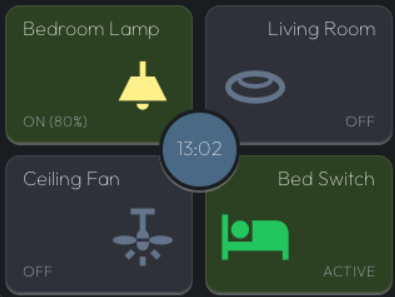
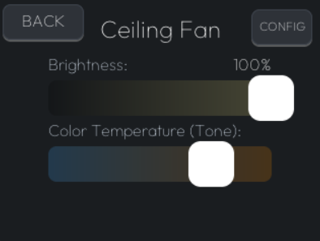
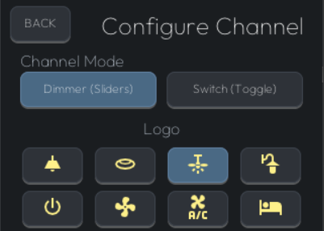
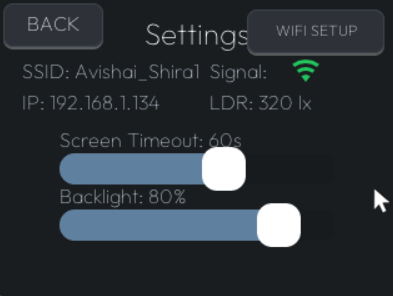

# Cheap Yellow Display (CYD) ESPHome Lights Controller

  

A state-of-the-art, premium touch-based control panel for your Home Assistant lights and switches. This project runs natively on the **Cheap Yellow Display (CYD / `esp32-2432S028`)**, leveraging the advanced hardware features of the ESP32 and ESPHome's declarative LVGL graphics component.

### ⚙️ Hardware Specifications:
* **Controller**: Espressif ESP32
* **Display**: 320x240 ILI9341 display
* **Touch Panel**: XPT2046 Resistive Touch Panel
* **Ambient Light**: Onboard LDR (Light Dependent Resistor)

---

## 📸 Dashboard Previews (Simulated Views)

To save space and keep your GitHub page clean, screenshots are resized to a crisp, uniform scale:

| Home Screen Dashboard | Dimmer Sub-Page | Channel Configuration | Settings Menu |
| :---: | :---: | :---: | :---: |
|  |  |  |  |

---

## 🚀 Core Features

### 1. Symmetrical 180° Screen & Touch Rotation
To support mounting the CYD upside down (or changing your micro-USB cable exit path), the entire visual layout is rotated exactly 180 degrees (`rotation: 180`). Touch inputs are mathematically calibrated and remapped (`swap_xy: true`, `mirror_x: false`, `mirror_y: false`) to ensure pixel-perfect and responsive landscape presses!

### 2. Premium Inactivity Screen Saver & "Zero-Click" Wake
* **Automated Fade-to-Black**: Uses LVGL's native C++ inactivity tracking API to smoothly fade the display backlight to `0%` over **0.5 seconds** when unused.
* **Accidental Click Interceptor**: Pauses LVGL's touch engine the instant the screen turns off. When you touch a dark screen, the controller turns the backlight on instantly (`0s` transition) and resumes LVGL, **completely discarding the first touch**. This ensures you can wake the screen without accidentally toggling lamps or sliders!

### 3. Symmetrical 2-Column Settings & 7-Step Timeout Slider
* **Balanced Grid Layout**: Reorganizes settings information (SSID, IP, LDR ambient light, and green WiFi bars) into a clean, two-column grid.
* **Non-Linear Timeout Control**: Provides an Outfit-styled screen timeout slider with **7 non-linear steps**: `5s`, `15s`, `30s`, `1m`, `3m`, `5m`, and `10m`, pre-populating with your saved choice on menu entry.

### 4. Advanced WiFi Battery Optimization (LIGHT Power Save)
Configures `power_save_mode: LIGHT` on the ESP32's WiFi radio. By pulsing the receiver in line with your router's beacon intervals, the idle screen-saver current draw drops from **35mA down to just ~12mA at 5V**—more than doubling battery life for portable remote builds, while retaining **instant (0.01s) click responsiveness** and lag-free bidirectional HA communication!

### 5. Dynamic Runtime Customization & Commits
Change button modes (Sliders vs Toggle Switch) and choose from **8 selectable MDI logos** (Bulb, Recessed Spot, Fan, Bed, Air Conditioner, etc.) directly from the CYD config page. Selection is permanently written to flash within **10 seconds** of any change using a throttled commit interval (`flash_write_interval: 10s`), protecting flash memory from wear while surviving power reboots.

### 6. Bidirectional Switch & Light Blueprints (Zero-Bounce)
Includes custom Home Assistant automation blueprints featuring strict **reconnection state guards**. When the CYD boots or recovers from a WiFi disconnect, these guards block the transition from `unavailable` to `off` from triggering a turn-off event on your physical lamps. If a bedroom lamp is already ON, the connecting CYD will smoothly synchronize and update its virtual state instead of shutting it down!

---

## 🛠️ Setup & Installation Guide

### Step 1: Flashing your CYD Controller
1. Open your **ESPHome Dashboard** in Home Assistant or locally on your PC.
2. Create a new device or edit your existing one, pasting the contents of [`esphome_cyd_lights.yaml`](esphome_cyd_lights.yaml).
3. Connect your Cheap Yellow Display board to your computer using a USB cable.
4. Install the bin file directly via your browser using [ESPHome Web Tools](https://web.esphome.io/).
5. *Important Boot Mode*: **Hold down the BOOT button on the back of your CYD board, press and release the RST button, then release the BOOT button** to ensure it enters flashable bootloader mode.

*Note: If you want to customize or recompile the binary file, you can compile and flash directly from ESPHome using the YAML configuration.*

### Step 2: Setting up Bidirectional Automations in HA
This repository includes two pre-configured synchronization blueprints:

1. **Light Synchronizer Blueprint**: [`zero_bounce_light_sync_blueprint.yaml`](zero_bounce_light_sync_blueprint.yaml)
   
2. **Switch/Generic Device Blueprint**: [`zero_bounce_switch_sync_blueprint.yaml`](zero_bounce_switch_sync_blueprint.yaml)
   

You can import them directly using the Home Assistant buttons above or copy them into your Home Assistant directory under `/config/blueprints/automation/`.

3. Go to **Settings > Automations & Scenes > Blueprints** and reload or re-import the blueprints.
4. Create a new automation from the blueprints:
   * Select your CYD virtual light/switch entity (e.g. `light.cyd_l1`).
   * Select the target physical lamp or smart switch in your room.
5. Save and enjoy a robust, bounce-free bidirectional synchronizer!

---

## 📝 Operating Notes & UI Controls

* **Auto-Symmetric Channel Layout**: When you add the device to Home Assistant, you will see 4 light channels and 4 switch channels. Each light channel is logically synchronized with its corresponding switch channel to allow easy setup.
* **Backlight Control**: The display screen's backlight brightness is exposed directly to Home Assistant as an adjustable dimmer light entity.
* **Quick Access Dimmer**: To enter the color temperature and brightness control sub-page for any light channel, simply **long-press the channel card for > 1 second**.
* **Dynamic Friendly Names**: You can rename any channel card name directly within Home Assistant's configuration panel—the display screen will update its text cards in real-time without needing a reflash!

---

## 🔌 Standalone Arduino IDE Version (No Home Assistant/ESPHome)

If you wish to use this premium visual touch dashboard for other hardware control projects (e.g., standard MQTT, Bluetooth, local relays, standalone appliances), you can find the **fully decoupled, standalone C++/LVGL Arduino sketch**

### How to Compile & Upload Standalone UI:
1. Install the **Arduino IDE** and make sure you have the **ESP32 board package** (v2.x or v3.x) installed.
2. Install these core libraries via the Arduino Library Manager:
   * **`lvgl`** (v8.x or v9.x)
   * **`TFT_eSPI`** (configured for the Cheap Yellow Display `ESP32-2432S028` pinout)
   * **`XPT2046_Touchscreen`** by Paul Stoffregen (standard resistive touch driver)
3. Open [`cyd_lights_arduino_ui.ino`](CYD_LVGL_UIi.ino) in Arduino IDE.
4. Select board **ESP32 Dev Module** or standard ESP32 board options.
5. Connect your Cheap Yellow Display via micro-USB, compile, and upload!

*Note: The standalone version is fully compatible with both LVGL v8 and v9, and uses LVGL's highly optimized built-in Montserrat fonts and standard library glyph symbols, ensuring it compiles instantly out-of-the-box with zero custom asset dependencies.*

---

## 🎁 Bonus Enclosure & Models

* **3D Printable Stand/Case**: If you want the premium visual case shown in the operational photo, you can download a beautiful, custom 3D-printable case design for this Cheap Yellow Display board from the original creator on Thingiverse: [Thingiverse #7047135](https://www.thingiverse.com/thing:7047135).

---

## 💡 Key Design Considerations for Forking

* **Gamma Correction**: ESPHome applies a default `2.8` gamma correction. Because these CYD lights are virtual and target physical lights that already perform their own gamma corrections, `gamma_correct: 0` is set to ensure a true **1:1 linear scaling** of brightness.
* **Flash Writes Protection**: Setting `flash_write_interval: 10s` is a perfect compromise between retaining your latest configurations across reboots and saving your ESP32's flash memory cells from quick degradation. Do not reduce this under `5s`.
* **MDI Glyphs Bounds**: When adding new custom icons to the logo picker, ensure their UTF-8 byte sequences are explicitly included in the `font:` configuration block of the YAML, or they will render as blank boxes.
